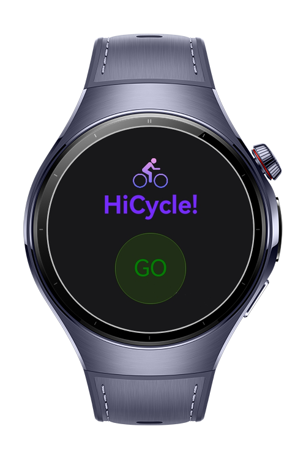
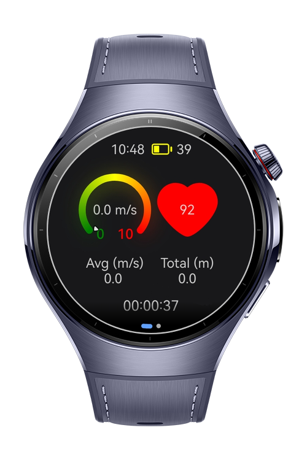
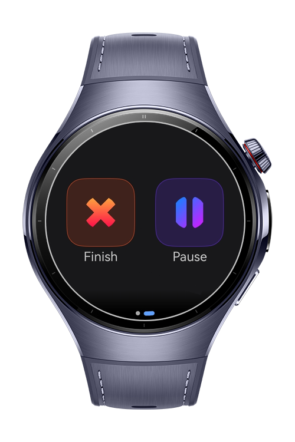

> **Note:** To access all shared projects, get information about environment setup, and view other guides, please visit [Explore-In-HMOS-Wearable Index](https://github.com/Explore-In-HMOS-Wearable/hmos-index).

# HiCycle
HiCycle helps you track and manage your cycling workouts effortlessly. It provides a clear, real-time workout panel where you can follow your speed, distance, average pace, heart rate, and elapsed time at a glance. With an easy-to-use control screen, HiCycle lets you pause, resume, or finish your workout anytime, so you can focus fully on your ride.

# Preview
<div>
	
	
	
</div>

# Use Cases

- ***Start Ride:*** Users can start a cycling session instantly and begin tracking all ride data with a single tap.
- ***Live Ride Tracking:*** During the ride, users can view real-time speed, total distance, average speed, heart rate, and elapsed time on a rich dashboard.
- ***Pause & Resume Ride:*** Users can pause and resume the cycling session anytime from the control screen.
- ***Finish Ride:*** Users can safely end the ride and stop all sensor and location tracking with one action.

# Tech Stack

- Languages: ArkTS (Ark TypeScript)

- Frameworks: HarmonyOS SDK 5.1.0 (API Version 18)

- Tools: DevEco Studio Version 5.1.0.842

- Libraries & Kits:
    - @kit.SensorServiceKit   Used for collecting real-time workout data such as motion and heart rate.
    - @kit.LocationKit Used for tracking user location and calculating distance during workouts.
    - @kit.MapKit Used to calculate total distance.
    - @kit.AbilityKit Enables app launch logic and intent routing via WantAgent.
    - @kit.BasicServicesKit	Provides BusinessError for handling exceptions and service errors.
    - @kit.PerformanceAnalysisKit	Utilized for logging and debugging via hilog.

# Directory Structure

```
|---components
|   |---ControlPage.ets           # Page for controlling game settings and options

|---pages
|   |---Index.ets                 # Entry point for routing and initialization

|---service
|   |---HeartRateService.ets      # Handles heart rate or sensor-based input (wrist shake)
|   |---NavigationService.ets     # Manages navigation between screens

|---viewmodel
|   |---BatteryVM.ets             # Tracks battery or device status if needed
|   |---HeartRateVM.ets           # State management for sensor interactions
|   |---SpeedVM.ets               # Handles speed or game pace-related data
|   |---TimerVM.ets               # Manages countdowns or timing for gameplay

```

# Constraints and Restrictions

## Supported Devices

- Huawei Watch 5
- Devices running HarmonyOS 5.1.0 (API 18) and above

# License

HiCycle is distributed under the terms of the MIT License
See the [LICENSE](./LICENSE) for more information.
